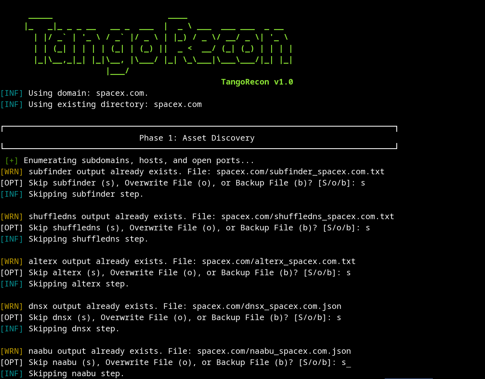
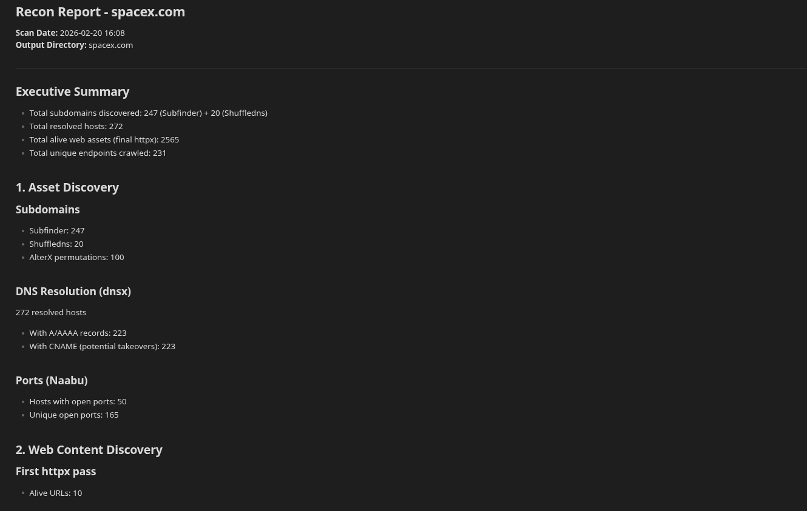
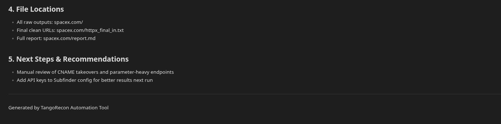

# TangoRecon

**TangoRecon** is a custom external reconnaissance automation tool built in Bash.
It chains 8 ProjectDiscovery tools (subfinder,shuffledns, alterx, dnsx, naabu, httpx, urlfinder, and katana) following NahamSec's methodology to gather actionable assets quickly and efficiently.

The script was created as a hands-on project to practice Bash scripting while building something useful for my bug bounty hunting, and vulnerability research.

## Features

- Interactive prompts for safer execution
- Progress and stats messages for each tool
- Final structured Markdown report with summaries & highlights
- Color-coded output for better readability

## Dependencies (must be installed beforehand)
- massdns (shuffledns, dnsx)
- masscan (naabu)

### Required tools ( they can be installed automatically via `-i tools` if missing)
- subfinder
- shuffledns
- alterx
- dnsx
- naabu
- httpx
- katana
- urlfinder

All installed via **PDTM** (ProjectDiscovery Tool Manager)

### Optional / Recommended
- `jq` — for structured report generation (highly recommended)
- A good public DNS resolvers list (https://github.com/trickest/resolvers)
- A good wordlist for bruteforcing (https://wordlists.assetnote.io)
- API keys from specialized asset databases to use with subfinder for better passive enumeration.

### System Requirements
- Linux / macOS (tested on Kali & Arch)
- Bash 4+
- Go (for PDTM to install tools)

## Installation

```bash
git clone https://github.com/alejoabalde/bash-cybersecurity-scripts.git
cd bash-cybersecurity-scripts
chmod +x TangoRecon
```

## Usage

### Install tools (first time only)

```bash
./TangoRecon -i tools
```

### Basic run (interactive)

```bash
./TangoRecon
```

### Non-interactive (recommended for scripting / CI)

```bash
./TangoRecon -d example.com
./TangoRecon -d example.com -o my-recon-output
```
```bash
TODO: Implement '-c defaults' for non-interactive
./TangoRecon -d example.com -o my-recon-output -c defaults
```

### Full help

```bash
./TangoRecon -h
```

## Example Output



**Final Report generated:**




## Legal & Ethical Use

**This tool is for authorized testing only.** Use only on:

- Bug bounty programs with explicit scope permission
- Assets you own or have written consent to test
- Approved internal red team exercises

Unauthorized use is illegal. Always obtain permission first.

## Built With

- Bash scripting (my first major project!)
- ProjectDiscovery tools (amazing open-source suite)

## Author

**Alejo Abalde Centurion** Cybersecurity professional | Buenos Aires, Argentina [LinkedIn](https://linkedin.com/in/alejoabalde) | [GitHub](https://github.com/alejoabalde)

## License

MIT License – feel free to fork, modify, and use (with proper attribution).

---
Made in Buenos Aires - practicing Bash one recon chain at a time.
